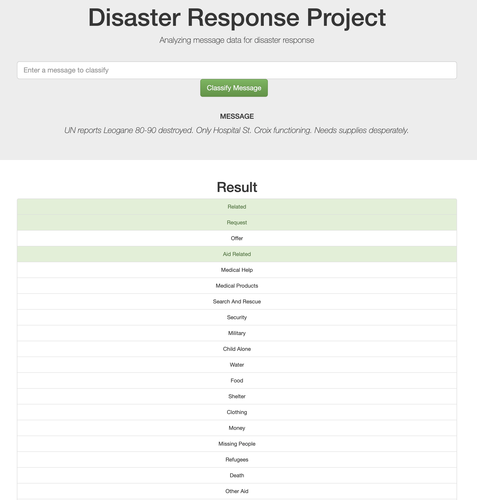

# Disaster Response Pipeline Project

In this project, direct messages received during emergencies, as well as messages through social media, will be classified into 36 categories.

Use supervised data from [Appento](https://appen.com/) to build a model for an API that classifies disaster messages.

### Instructions:
1. Run the following commands in the project's root directory to set up your database and model.

    - To run ETL pipeline that cleans data and stores in database
        `python data/process_data.py data/disaster_messages.csv data/disaster_categories.csv data/DisasterResponse.db`
    - To run ML pipeline that trains classifier and saves
        `python models/train_classifier.py data/DisasterResponse.db models/classifier.pkl`

2. Go to `app` directory: `cd app`

3. Run your web app: `python run.py`

4. Open the homepage `http://localhost:3000` 

### Program and Libraries

- Python 3.8.8 : https://www.python.org/
- Jupyter Notebook : https://jupyter.org/
- Pandas : https://pandas.pydata.org/
- NumPy : https://numpy.org/
- Natural Language Toolkit(NLTK) : https://www.nltk.org/
- Scikit-lean : https://scikit-learn.org/stable/

# References

 - Appen Dataset : https://appen.com/
 - Udacity DataScience ND : https://www.udacity.com/course/data-scientist-nanodegree--nd025